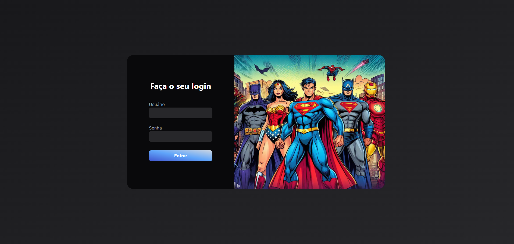
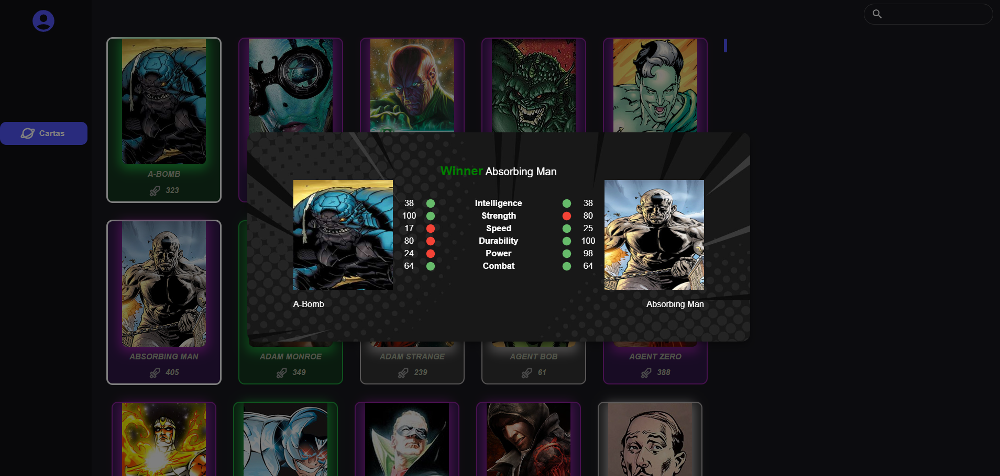

# Desafio Azapfy

# 🎯Objetivo:

Desenvolver o front-end de uma aplicação web que abrace a temática de heróis, consumindo a API <link>http://homologacao3.azapfy.com.br/api/ps/metahumans</link>.

## 🔧 Foi desenvolvido:

- Formulário de login
- Listagem de heróis
- Filtro de heróis
- Sistema de combate
  
# 🖥️Tecnologias utilizadas:

# 🛠️ Como Utilizar:

1. Clone o repositório para sua máquina utilizando o comando:
  
	`git clone git@github.com:leonardocbrand/azapfy-challenge.git`

2. Abra um terminal na **pasta raiz do repositório** e execute o comando <code>npm run dev</code>

3. Após isso, você poderá acessar o frontend da aplicação localmente através do localhost na porta 3000, no link: <link>http://localhost:3000</link>.

# Deploy

<link>https://azapfy-challenge.vercel.app/</link> (Há que permitir o conteúdo inseguro nas configurações do navegador para visualizar todo o conteúdo do site)

## 📷 Preview:

#### Início

#### Dashboard

